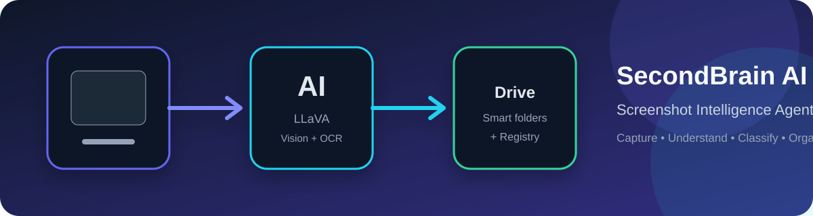
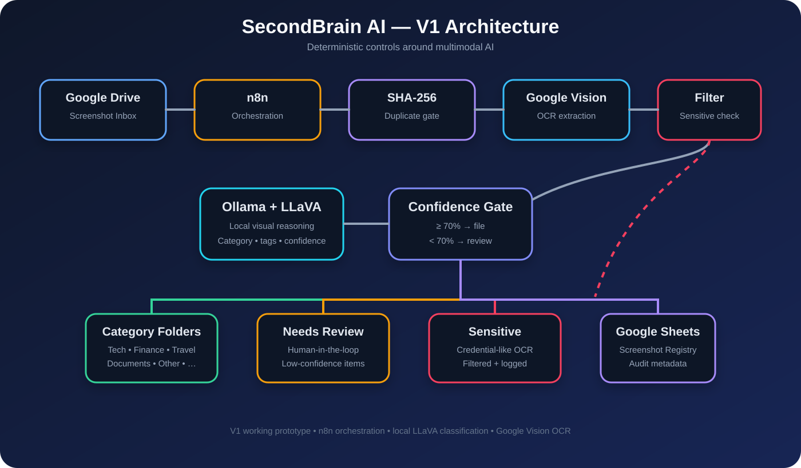
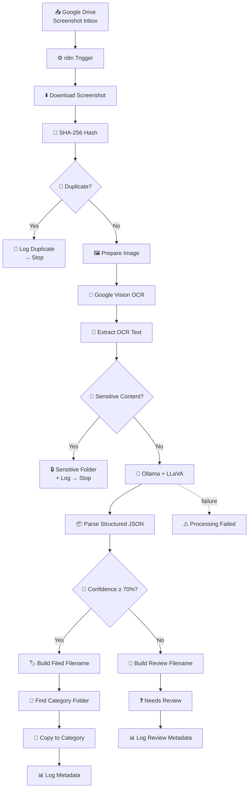

# 🧠 SecondBrain AI — Screenshot Intelligence Agent

<p align="center">
  <strong>Turn screenshots into an organized, searchable personal knowledge layer — automatically.</strong>
</p>

<p align="center">
  
</p>

<p align="center">
  <a href="https://github.com/Srinidhisn5/secondbrain-ai"></a>
  
  
  
  
  
  
</p>

---

## 🎯 What is SecondBrain AI?

**SecondBrain AI** is an automation-first screenshot intelligence system.

Instead of leaving hundreds of screenshots in one folder, the system turns the screenshot inbox into a lightweight knowledge-management pipeline:

> **Capture → Download → Hash → Deduplicate → OCR → Sensitive Filter → Vision Classification → Confidence Routing → Rename → File → Register**

The first module, **Screenshot Agent V1**, is built around **n8n**, **Google Drive**, **Google Vision OCR**, and a **local Ollama + LLaVA vision model**.

It can determine what a screenshot is about, extract useful text, detect potential sensitive information, avoid processing the same image twice, route uncertain images to manual review, and maintain a processing registry.

---

## ✨ Why build this?

Screenshots are useful because they capture information quickly — but they become difficult to manage at scale.

Typical screenshot folders contain:

- 📈 finance and market information
- 💻 programming and technical content
- 🛍️ shopping/product references
- ✈️ travel information
- 💼 LinkedIn/career content
- 📄 documents and notes
- 🔐 potentially sensitive information
- ❓ screenshots that are difficult to classify automatically

SecondBrain AI treats screenshots as **structured inputs**, not just files.

### The goal

Reduce the manual work required to answer:

> **“What is this screenshot, where should it go, and have I already processed it?”**

---

# 🏗️ Architecture

<p align="center">
  
</p>

### High-level flow



---

# 🔄 End-to-End Workflow

| Stage | Component | Responsibility |
|---|---|---|
| 1 | Google Drive Trigger | Detect a new screenshot |
| 2 | Download Screenshot | Bring the binary into n8n |
| 3 | SHA-256 | Create a content fingerprint |
| 4 | Duplicate Check | Stop already-known screenshots |
| 5 | Image Preparation | Convert image to Base64 for OCR |
| 6 | Google Vision | Extract visible text |
| 7 | Sensitive Filter | Check OCR text for sensitive patterns |
| 8 | Ollama + LLaVA | Understand the screenshot visually |
| 9 | JSON Parser | Normalize the AI response |
| 10 | Confidence Gate | Decide filed vs. review |
| 11 | Filename Builder | Generate a consistent filename |
| 12 | Folder Lookup | Find the category folder dynamically |
| 13 | Google Drive | Copy the screenshot to its destination |
| 14 | Google Sheets | Record processing metadata |
| 15 | Failure Path | Record processing failures |

---

# 🧠 The Intelligence Layer

The system deliberately combines **deterministic automation** with **AI reasoning**.

### Deterministic logic

Used where predictable behavior matters:

- SHA-256 duplicate detection
- regex-based sensitive-content filtering
- confidence threshold routing
- filename normalization
- folder lookup
- metadata logging

### AI reasoning

Used where visual understanding is required:

- screenshot classification
- semantic understanding of image content
- tag generation
- filename description generation
- classification reasoning

This separation is important:

> **Rules handle what should be deterministic. AI handles what requires interpretation.**

---

# 🛡️ Sensitive Content Protection

The workflow does **not** send every screenshot directly to the vision model.

After OCR, a local filter checks for patterns such as:

- OTP / one-time passwords
- verification codes
- PINs
- CVV/CVC
- account numbers
- payment-card-like number patterns
- “do not share” + credential patterns

If a match is found:

```text
Screenshot
   ↓
OCR
   ↓
Sensitive Filter
   ↓
YES
   ↓
Sensitive Folder
   ↓
Log as SENSITIVE
   ↓
Stop
```

### Important privacy note

The current V1 performs **Google Vision OCR before the sensitive filter**. Therefore, this is **not a zero-cloud privacy architecture**.

The screenshot reaches Google Vision for OCR before the local sensitive-content decision is made.

The **AI classification step uses Ollama + LLaVA locally**.

This distinction is intentionally documented so the security boundary is clear.

---

# ♻️ Duplicate Detection

Every screenshot receives a SHA-256 content hash.

Example:

```text
e039e3ac0c70a40509c7a2ef739479d182773ffdccdf31ed01258ad26bb65dd2
```

The hash is checked against the Screenshot Registry before expensive processing.

### Why hash instead of filename?

Two files can have different names while containing the same bytes:

```text
coding.png
codings.png
```

If their content hash is identical, the workflow treats the second file as a duplicate.

This makes duplicate detection **content-based rather than filename-based**.

---

# 🎯 Confidence-Based Routing

The vision model returns structured information similar to:

```json
{
  "category": "Tech",
  "confidence": 95,
  "tags": ["programming", "AI", "Python"],
  "filename_description": "python-code-with-AI-similarity-detection-explorer",
  "classification_reason": "The screenshot contains programming code and an AI similarity detection project."
}
```

The workflow then applies:

```text
confidence >= 70
        │
   ┌────┴────┐
   │         │
  YES       NO
   │         │
  File      Review
```

### Why have a review queue?

An automation system should not pretend that every AI prediction is correct.

Low-confidence screenshots are routed to:

> **Needs Review**

This creates a practical **human-in-the-loop** boundary.

---

# 📂 Example Organization

A screenshot inbox can evolve into:

```text
Google Drive
│
├── 📥 Screenshot Inbox
│
├── 💻 Tech
│   ├── Tech_2026-09-13_python-code-with-AI-similarity-detection-explorer.png
│   └── ...
│
├── 📈 Finance
│   ├── Finance_2026-09-13_multibagger.png
│   └── ...
│
├── 🛍️ Shopping
├── ✈️ Travel
├── 💼 LinkedIn
├── 📄 Documents
├── 📦 Other
│
├── ❓ Needs Review
├── 🔒 Sensitive
└── ⚠️ Processing Failed
```

The original screenshot name does **not** need to contain the category.

The classification is based on the screenshot's **OCR text + visual content**.

---

# 🧪 Tested V1 Behaviors

The current V1 has been exercised against representative cases:

| Test | Result |
|---|---|
| Finance screenshot | ✅ Classified and filed |
| Programming screenshot | ✅ Classified as Tech |
| Duplicate screenshot | ✅ Detected by SHA-256 |
| OTP / verification-code screenshot | ✅ Sent to Sensitive |
| Low-confidence screenshot | ✅ Sent to Needs Review |
| Processing failure | ✅ Logged as PROCESSING_FAILED |
| End-to-end Drive trigger | ✅ Working |

---

# 🧰 Technology Stack

### Automation

**n8n**

Orchestrates the complete workflow and connects the external services.

### Storage

**Google Drive**

Used for:

- screenshot inbox
- category folders
- sensitive items
- review queue
- processing-failure queue

**Google Sheets**

Used as the Screenshot Registry.

Current schema:

```text
sha256_hash
filename
category
tags
processed_at
```

### OCR

**Google Cloud Vision API**

Used for text extraction from screenshots.

### Vision AI

**Ollama + LLaVA**

Used for local visual understanding and screenshot classification.

### Runtime

**Docker**

Runs the n8n instance.

### Supporting scripts

Python utilities are included under:

```text
scripts/
```

---

# 📁 Repository Structure

```text
secondbrain-ai/
│
├── 📂 dataset/
│   ├── README.md
│   └── sample_screenshots/
│
├── 📂 docs/
│   ├── architecture.md
│   ├── metadata_schema.md
│   ├── requirements.md
│   └── assets/
│
├── 📂 n8n/
│   └── workflow.json
│
├── 📂 prompts/
│   └── vision_prompt.md
│
├── 📂 screenshots/
│   └── .gitkeep
│
├── 📂 scripts/
│   ├── duplicate_hash.py
│   ├── ocr_wrapper.py
│   └── requirements.txt
│
├── .gitignore
├── README.md
├── ROADMAP.md
└── VISION.md
```

---

# 🚀 Quick Start

## 1. Clone the repository

```bash
git clone https://github.com/Srinidhisn5/secondbrain-ai.git
cd secondbrain-ai
```

## 2. Install the prerequisites

You need:

- Docker
- n8n
- Ollama
- LLaVA
- Google Cloud Vision API
- Google Drive
- Google Sheets

For the current Windows setup, n8n runs in Docker while Ollama runs on the host machine.

---

## 3. Pull the vision model

```bash
ollama pull llava:latest
```

Verify:

```bash
ollama list
```

The model should appear as:

```text
llava:latest
```

---

## 4. Start n8n

Example:

```bash
docker run -d \
  --name n8n \
  --restart unless-stopped \
  -p 5678:5678 \
  -e N8N_RUNNERS_MODE=internal \
  -e NODE_FUNCTION_ALLOW_BUILTIN=crypto \
  -v "<YOUR_N8N_DATA_PATH>:/home/node/.n8n" \
  n8nio/n8n:latest
```

Then open:

```text
http://localhost:5678
```

---

# 🔧 n8n Configuration

Import:

```text
n8n/workflow.json
```

Then recreate/connect your own credentials.

You will need:

### Google Drive credential

Used for:

- trigger
- download
- duplicate lookup
- folder lookup
- copy/move operations

### Google Sheets credential

Used for the Screenshot Registry.

### Google Vision API credential

The workflow expects:

```text
https://vision.googleapis.com/v1/images:annotate
```

with a valid API credential configured in your own environment.

### Ollama

The n8n container must be able to reach the host Ollama service.

On Docker Desktop:

```text
http://host.docker.internal:11434
```

---

# 🔐 Configuration Safety

**Never commit:**

- Google API keys
- OAuth client secrets
- refresh tokens
- access tokens
- `.env` files
- private screenshots
- n8n runtime data
- local databases

The repository intentionally uses placeholders instead of personal Drive/Sheets identifiers.

Before publishing changes, perform a secret scan.

Example:

```bash
git grep -n -I -E "AIza[0-9A-Za-z_-]{20,}|sk-[0-9A-Za-z_-]{20,}|BEGIN (RSA|OPENSSH|EC|PRIVATE) KEY|client_secret|access_token|refresh_token|Bearer [A-Za-z0-9._-]{20,}"
```

A clean result should produce no matches.

---

# 📊 Metadata Registry

Each successfully processed screenshot can produce metadata such as:

```text
SHA-256
Filename
Category
Tags
Processed timestamp
```

Additional runtime information is carried through the n8n workflow, including:

```text
OCR text
Confidence
Classification reason
Processing time
Workflow version
Retry count
```

The registry provides a lightweight audit trail for what happened to each screenshot.

---

# ⚙️ Reliability Design

V1 includes several defensive mechanisms:

### Duplicate protection

SHA-256 prevents repeat processing.

### AI response parsing

Malformed AI JSON falls back to a safe `Other` classification with zero confidence.

### Confidence threshold

Uncertain results are not automatically filed.

### Retry configuration

The OCR and Ollama stages use retry behavior in the workflow.

### Failure path

Processing failures can be routed to a dedicated failure folder and logged as:

```text
PROCESSING_FAILED
```

---

# ⚠️ Current V1 Limitations

This project is intentionally a **V1**, not a finished production platform.

Known limitations include:

- Google Vision OCR is cloud-based.
- Sensitive filtering happens after OCR.
- Filename generation currently normalizes output to `.png`.
- Category folders must exist for dynamic folder lookup to succeed.
- Google credentials must be configured by each user.
- The review queue is currently folder-based rather than a full review UI.
- Classification quality depends on the selected vision model.
- The current registry is Google Sheets rather than a dedicated database.

These are documented design constraints rather than hidden assumptions.

---

# 🗺️ Roadmap

### V1 — Screenshot Agent
- [x] Google Drive trigger
- [x] SHA-256 duplicate detection
- [x] OCR extraction
- [x] sensitive-content filter
- [x] local vision classification
- [x] confidence routing
- [x] automatic categorization
- [x] metadata registry
- [x] processing-failure path

### V2 — Better Intelligence
- [ ] stronger structured classification schema
- [ ] improved filename generation
- [ ] richer metadata
- [ ] better sensitive-content detection
- [ ] confidence calibration
- [ ] automated evaluation dataset

### V3 — SecondBrain
- [ ] semantic search
- [ ] embeddings
- [ ] screenshot-to-knowledge retrieval
- [ ] relationship detection between screenshots
- [ ] natural-language queries
- [ ] knowledge graph
- [ ] personal knowledge dashboard

---

# 🧩 Design Principles

SecondBrain AI follows a few simple engineering principles:

### 1. Automate repetitive work

Humans should not manually rename and move hundreds of screenshots.

### 2. Keep deterministic logic deterministic

Use hashes, rules and thresholds where possible.

### 3. Use AI where interpretation is needed

Visual classification is a good fit for a vision model.

### 4. Never trust AI blindly

Low-confidence outputs go to review.

### 5. Keep an audit trail

Important processing decisions are logged.

### 6. Fail visibly

Failures should be captured and observable rather than silently disappearing.

### 7. Document the security boundary

Cloud OCR and local AI are different privacy boundaries and should be treated differently.

---

# 💡 What I Learned Building This

This project is more than an n8n workflow. It explores how to combine:

- workflow automation
- API integration
- Docker networking
- local AI inference
- multimodal models
- OCR
- deterministic validation
- duplicate detection
- data classification
- human-in-the-loop systems
- structured metadata
- failure handling
- Git/GitHub project hygiene

The central engineering lesson is:

> **Reliable AI automation is not just an AI model. It is the system around the model.**

---

# 📚 Documentation

| Document | Purpose |
|---|---|
| [`docs/architecture.md`](docs/architecture.md) | System architecture |
| [`docs/metadata_schema.md`](docs/metadata_schema.md) | Registry fields |
| [`docs/requirements.md`](docs/requirements.md) | Requirements |
| [`prompts/vision_prompt.md`](prompts/vision_prompt.md) | Vision classification prompt |
| [`ROADMAP.md`](ROADMAP.md) | Future development |
| [`VISION.md`](VISION.md) | Long-term SecondBrain direction |

---

# 🤝 Contributing

Ideas, improvements and experiments are welcome.

A useful contribution should ideally include:

1. a clear problem statement
2. the proposed change
3. testing evidence
4. documentation updates where required
5. no secrets or private data

---

# 📌 Project Status

**Current version:** V1  
**Status:** Working prototype / active development  
**Primary workflow:** n8n  
**Vision model:** Ollama + LLaVA  
**OCR:** Google Vision  
**Storage:** Google Drive + Google Sheets

---

<p align="center">
  <strong>SecondBrain AI</strong><br>
  Turning screenshots into structured knowledge.
</p>
